# Module_20_Challenge
Note the code is in joint_savings.sol.
### Step_1.1
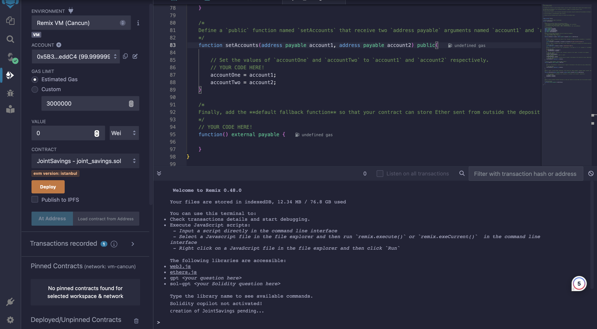
### Step_1.2
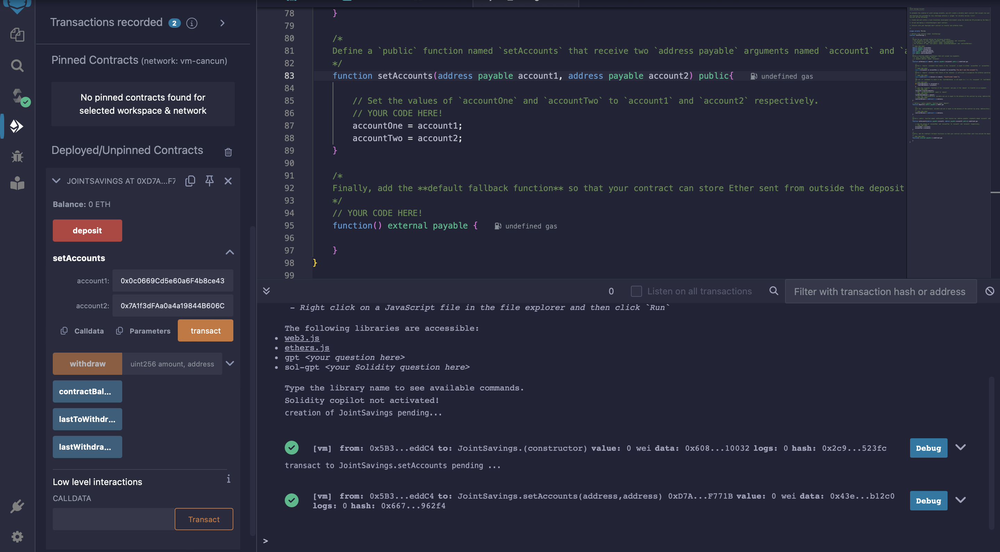
### Step_2,1
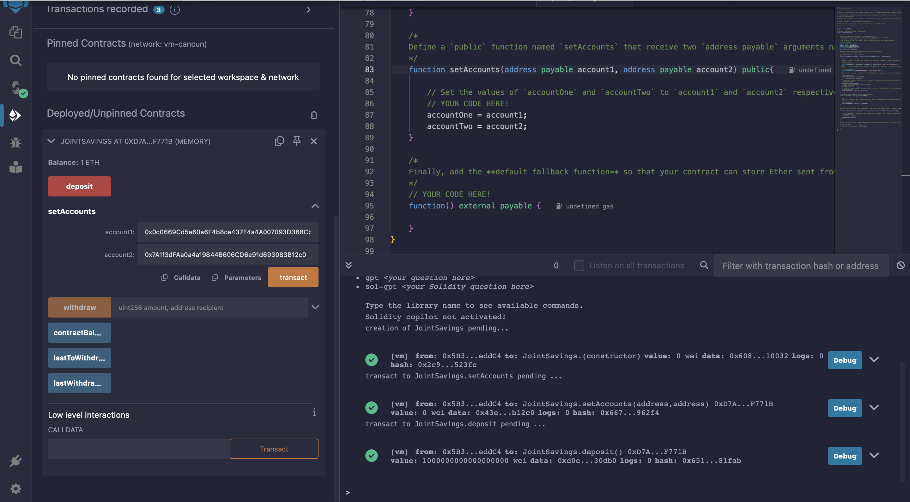
### Step_2.2_after_transaction_1ether
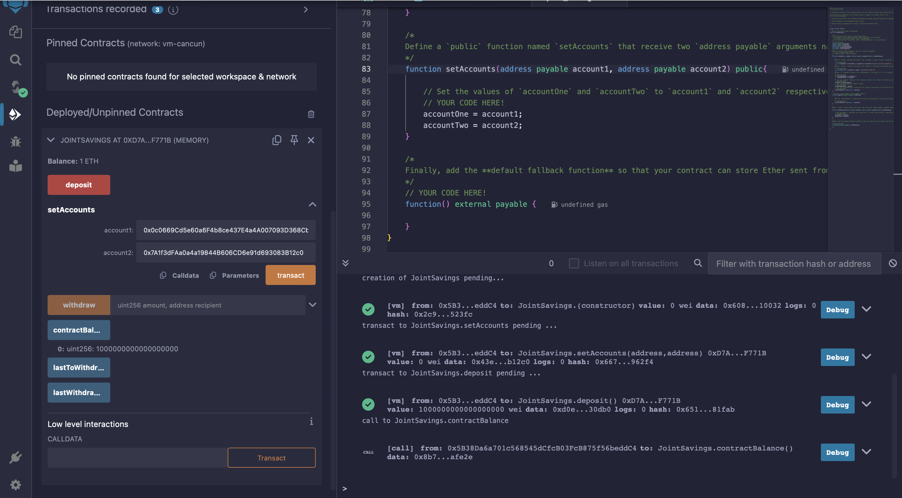
### Step_2.3_after_transaction_10ether
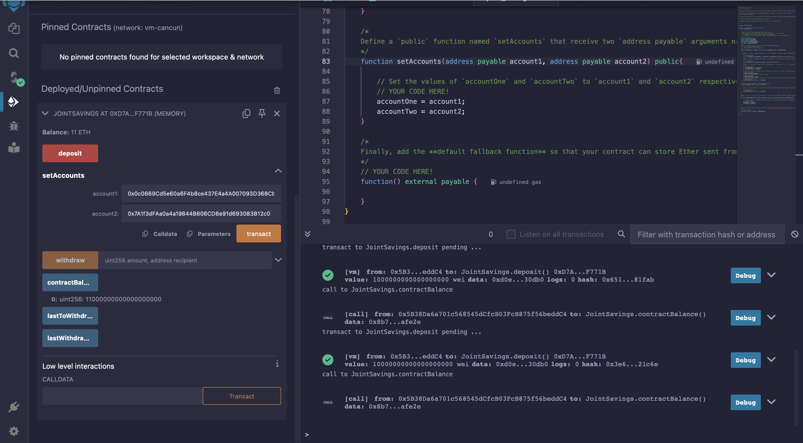
### Step_2.4_after_transaction_1ether
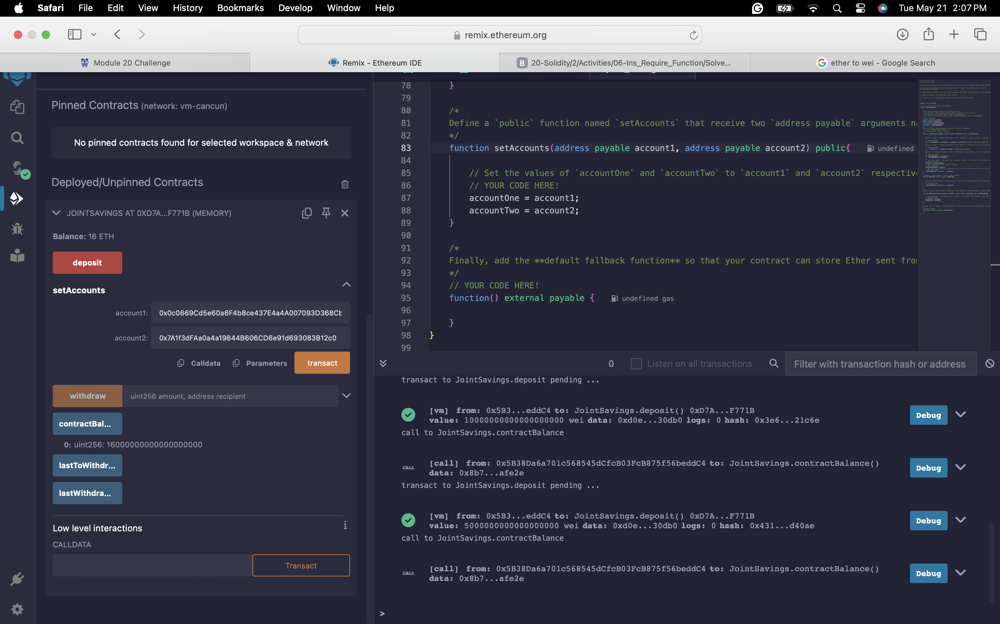
### Step_3.1_before_withdraw
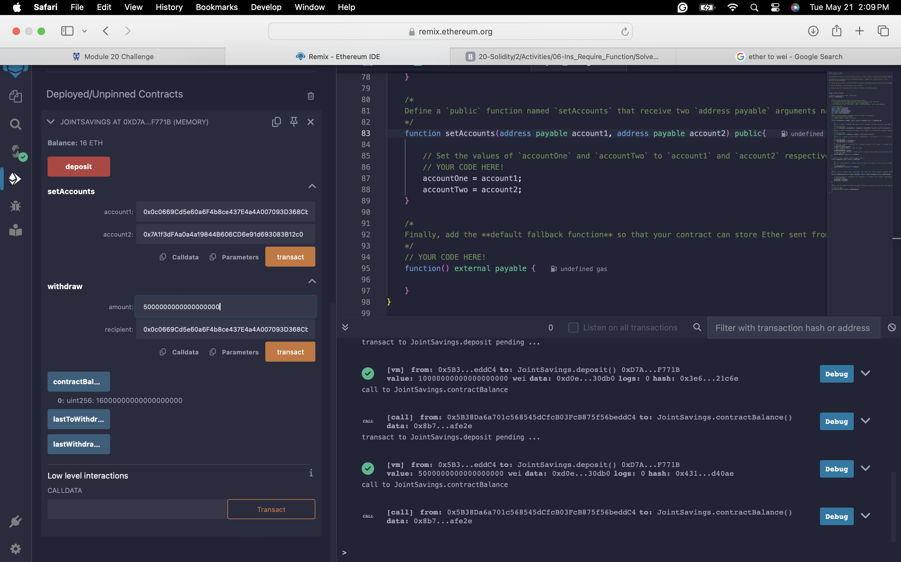
### Step_3.2_after_withdraw_to_account1
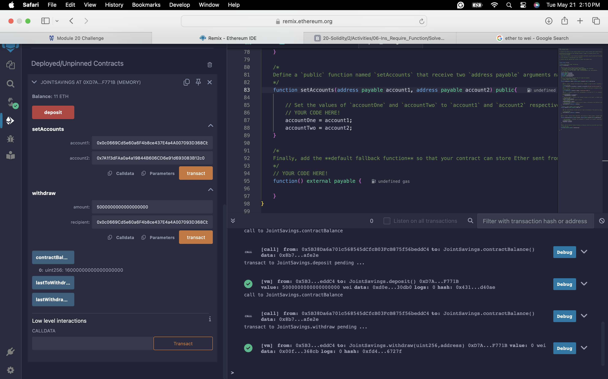
### Step_3.2_withdraw_to_account1
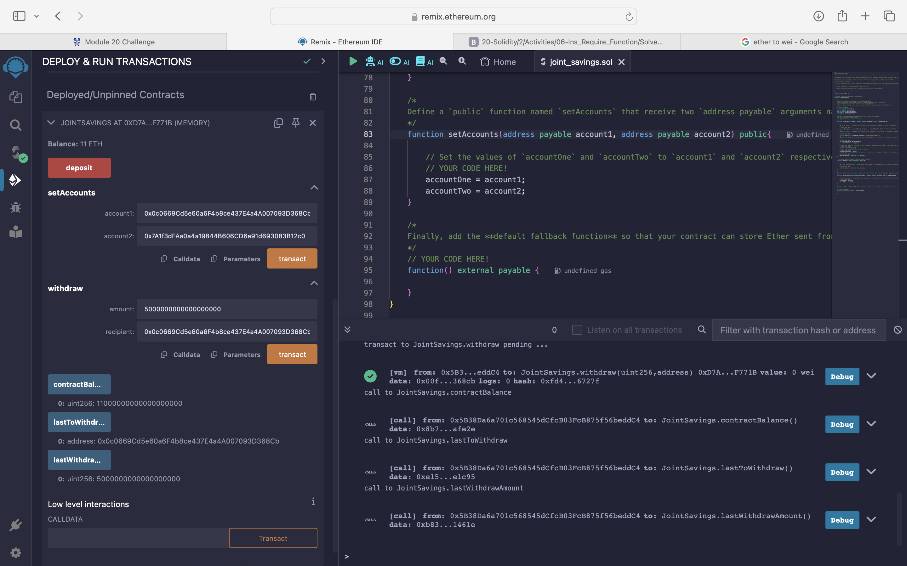
### Step_3.3_withdraw_to_account2
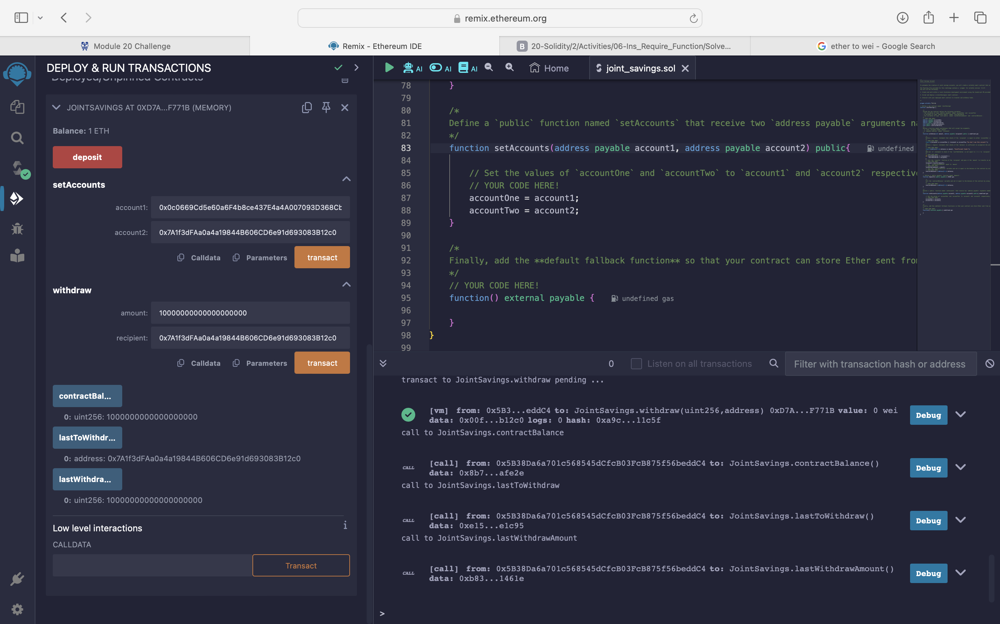
### Lasttowithdraw_and_Lasttowithdrawamount
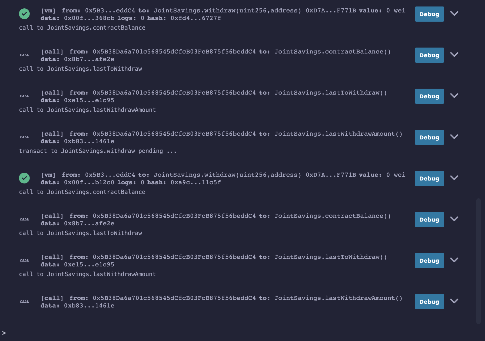
